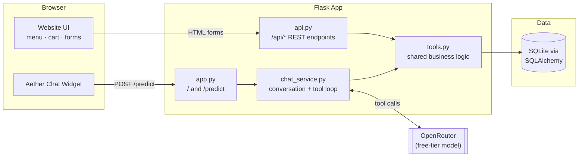
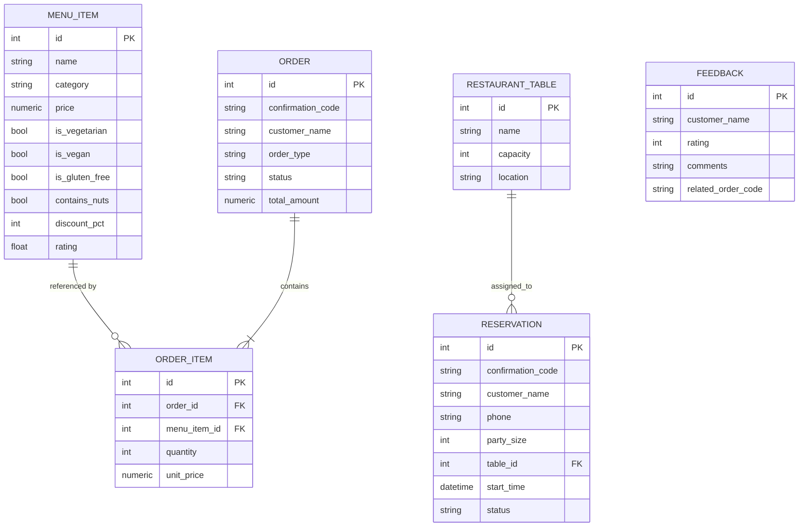

<div align="center">

# 🍽️ Velvet Fork — AI-Native Restaurant Ordering Platform

**A Flask restaurant website with a real, database-backed AI customer care agent.**
Reservations, food ordering, cancellations, and feedback — all driven by tool-calling LLMs via [OpenRouter](https://openrouter.ai), backed by an actual SQL schema, not mock data.

[](https://www.python.org/)
[](https://flask.palletsprojects.com/)
[](https://www.sqlalchemy.org/)
[](https://openrouter.ai/)
[](./tests)
[](#-license)

</div>

---

## 📖 Table of Contents

- [Overview](#-overview)
- [Features](#-features)
- [Architecture](#-architecture)
- [Tech Stack](#-tech-stack)
- [Project Structure](#-project-structure)
- [Getting Started](#-getting-started)
  - [Prerequisites](#prerequisites)
  - [Installation](#installation)
  - [Environment Variables](#environment-variables)
  - [Database Setup](#database-setup)
  - [Running the App](#running-the-app)
- [The AI Agent](#-the-ai-agent)
  - [Available Tools](#available-tools)
  - [Grounding Rules](#grounding-rules)
- [API Reference](#-api-reference)
- [Data Model](#-data-model)
- [Testing](#-testing)
- [Design Notes & Gotchas](#-design-notes--gotchas)
- [Roadmap](#-roadmap)
- [License](#-license)

---

## 🧭 Overview

**Velvet Fork** is a full-stack demo restaurant platform built to show what an AI customer-care
integration looks like when it's wired directly into real business logic instead of a scripted
FAQ bot. A visitor can browse a real menu, book a table, place a delivery/pickup order, or leave
feedback — either through the website UI directly, **or** by chatting with **Aether**, an
OpenRouter-backed assistant that calls the exact same backend functions the web forms use.

> [!NOTE]
> Every reservation and order action available to the chatbot (`tools.py`) is also exposed as a
> plain REST endpoint (`api.py`). The LLM has no special access — it's just another client of the
> same business logic, which is what keeps its answers grounded in real data.

## ✨ Features

- [x] 🍔 **Live menu** with categories, dietary tags, images, ratings, and discount pricing
- [x] 🛒 **Cart → checkout** flow for delivery or pickup orders
- [x] 📅 **Table reservations** with real-time availability checks against table capacity
- [x] ✏️ **Modify / cancel** for both reservations and orders, verified by confirmation code + phone
- [x] 💬 **Aether**, an AI chat widget that can do everything the UI can do, conversationally
- [x] 📊 **Markdown-aware chat rendering** — the assistant returns menu listings as real tables, not walls of text
- [x] 🖥️ **Fullscreen chat mode** with page-scroll locking
- [x] 📝 **Feedback & complaints** capture, optionally linked to an order
- [x] 🧪 **Pytest suite** covering availability logic, reservations, orders, and tool dispatch
- [x] 🆓 **Free-tier only** LLM usage — no paid OpenRouter models in the default config

## 🏗️ Architecture



| Layer | File(s) | Responsibility |
|---|---|---|
| **Web server** | `app.py` | Serves the homepage (`/`) and the chat endpoint (`/predict`); manages the session cookie. |
| **REST API** | `api.py` | Direct JSON endpoints for menu, reservations, orders, and feedback — used by the website's own forms. |
| **Chat orchestration** | `chat_service.py` | Builds the system prompt, drives the OpenRouter tool-calling loop, caps iterations, trims history. |
| **LLM client** | `llm_client.py` | Thin OpenRouter/OpenAI-SDK wrapper; primary + free-tier fallback model selection. |
| **Tool schemas** | `tool_schemas.py` | OpenAI-format function schemas + name → callable dispatch table. |
| **Business logic** | `tools.py` | Single source of truth: availability checks, CRUD for reservations/orders/feedback, validation. |
| **Persistence** | `db.py`, `db_models.py` | SQLAlchemy engine/session setup and the six ORM models. |
| **Static content** | `restaurant_info.py` | Restaurant facts (address, hours, policies) shared by the UI and the system prompt. |
| **Frontend** | `templates/`, `static/` | Jinja templates, self-hosted SVG icon sprite, CSS, and vanilla JS (no frontend framework, no CDN dependencies). |

## 🧰 Tech Stack

<table>
<tr><td><strong>Backend</strong></td><td>Python 3.11+, Flask 3.0, SQLAlchemy 2.0, SQLite</td></tr>
<tr><td><strong>AI / LLM</strong></td><td>OpenRouter (OpenAI-compatible API), free-tier tool-calling models with automatic fallback</td></tr>
<tr><td><strong>Frontend</strong></td><td>Jinja2 templates, hand-written CSS (CSS custom properties, no framework), vanilla JS</td></tr>
<tr><td><strong>Icons</strong></td><td>Self-hosted Ionicons SVG sprite (no external CDN calls)</td></tr>
<tr><td><strong>Testing</strong></td><td>pytest, isolated in-memory/temp SQLite fixtures</td></tr>
</table>

## 📁 Project Structure

```text
AI customer care chatbot/
├── app.py                 # Flask entrypoint — routes: "/" and "/predict"
├── api.py                 # REST blueprint under /api/*
├── chat_service.py        # System prompt + tool-calling conversation loop
├── llm_client.py          # OpenRouter client wrapper
├── tool_schemas.py        # Function-calling schemas + dispatch table
├── tools.py                # Core business logic (validation, CRUD, availability)
├── db.py / db_models.py   # SQLAlchemy engine + ORM models
├── restaurant_info.py     # Restaurant facts (name, hours, address, policies)
├── seed_data.py           # Seeds menu items + tables into the database
├── config.py               # Env-driven configuration
├── requirements.txt
├── .env.example
├── templates/
│   ├── index.html          # Single-page site (hero, menu, reservation, chat widget…)
│   └── _icons.html          # Self-hosted SVG icon sprite
├── static/
│   ├── css/style.css        # Design tokens + full stylesheet
│   ├── js/{app.js,script.js} # Chat widget logic + site interactions
│   └── images/               # Self-hosted avatar/icon assets
└── tests/
    ├── conftest.py
    ├── test_availability.py
    ├── test_reservations.py
    ├── test_orders.py
    └── test_tools_dispatch.py
```

## 🚀 Getting Started

### Prerequisites

- Python **3.11+**
- An [OpenRouter](https://openrouter.ai/keys) account (free — no payment method required for free-tier models)

### Installation

```bash
python -m venv .venv

# Windows
.venv\Scripts\activate
# macOS / Linux
source .venv/bin/activate

pip install -r requirements.txt
```

### Environment Variables

```bash
# Windows
copy .env.example .env
# macOS / Linux
cp .env.example .env
```

| Variable | Default | Description |
|---|---|---|
| `OPENROUTER_API_KEY` | *(empty)* | **Required for chat.** Get one free at [openrouter.ai/keys](https://openrouter.ai/keys). |
| `OPENROUTER_BASE_URL` | `https://openrouter.ai/api/v1` | OpenRouter's OpenAI-compatible base URL. |
| `OPENROUTER_MODEL` | `openrouter/free` | Auto-router that picks a free tool-calling-capable model. |
| `OPENROUTER_FALLBACK_MODEL` | `meta-llama/llama-3.3-70b-instruct:free` | Used if the primary call fails. **Free-tier only** — never set this to a paid model id. |
| `FLASK_SECRET_KEY` | random hex | Signs the session cookie. Generate your own: `python -c "import secrets; print(secrets.token_hex(32))"` |
| `DATABASE_URL` | `sqlite:///restaurant.db` | SQLAlchemy connection string. |
| `FLASK_DEBUG` | `1` | Enables the Flask reloader/debugger. Set to `0` in anything resembling production. |

> [!IMPORTANT]
> Without `OPENROUTER_API_KEY` set, the **website and every direct `/api/*` endpoint still work
> fully** (menu, reservations, orders, feedback). Only the chat widget (`/predict`) degrades to a
> "not configured yet" message.

### Database Setup

```bash
python seed_data.py
```

This creates the SQLite file (if missing) and seeds it with menu items and restaurant tables.

### Running the App

```bash
python app.py
```

Then open **http://127.0.0.1:5000/**.

## 🤖 The AI Agent

Aether is not a wrapper around a static FAQ — it's a tool-calling agent (`chat_service.py`) that
reasons over the conversation and calls real backend functions to check facts, book tables, and
place orders. It shares its business logic 1:1 with the REST API, so it cannot answer with data
the database doesn't actually have.

### Available Tools

<details>
<summary><strong>Click to expand — 11 tools exposed to the model</strong></summary>

| Tool | Purpose |
|---|---|
| `get_restaurant_info` | Address, phone, hours, policies, dietary notes, current promotions. |
| `get_menu` | Menu items, optionally filtered by category or dietary flag. |
| `check_availability` | Finds a free table for a given time + party size. Always called before booking. |
| `create_reservation` | Books a table after availability is confirmed and details are collected. |
| `modify_reservation` | Changes time/party size — requires confirmation code **and** phone. |
| `cancel_reservation` | Cancels a booking — requires confirmation code **and** phone. |
| `get_reservation_status` | Looks up an existing reservation. |
| `place_order` | Creates a delivery/pickup order from menu item names/IDs and quantities. |
| `get_order_status` | Looks up an existing order. |
| `cancel_order` | Cancels an order — requires confirmation code **and** phone. |
| `submit_feedback` | Records a 1–5 rating with comments, optionally linked to an order. |

</details>

### Grounding Rules

The system prompt (`chat_service.py`) enforces a small set of hard rules so the assistant can't
hallucinate business-critical details:

1. **Never invent** menu items, prices, hours, or policies — always call a tool for factual data.
2. **Never fabricate** customer details — collect everything from the user before booking/ordering.
3. **Identity is verified** by `confirmation_code` + `phone` together for any modify/cancel/status action — there is no login system, so this pair *is* the auth.
4. **Confirm before finalizing** — the assistant summarizes and asks before calling `create_reservation` or `place_order`, then clearly states the confirmation code afterward.
5. **Menu listings render as Markdown tables** (`Name | Price | Category | Dietary`) so the chat UI can display them as real tables instead of prose.

## 🔌 API Reference

All endpoints below are mounted under the `/api` prefix and return JSON. The chatbot's tools call
this exact same logic internally (via `tools.py`), so behavior is identical either way.

| Method | Endpoint | Description |
|---|---|---|
| `GET` | `/api/menu` | List menu items, optional `category` / `dietary` query params. |
| `GET` | `/api/restaurant-info` | Restaurant facts (address, hours, policies…). |
| `GET` | `/api/reservations/availability` | Check table availability for a time + party size. |
| `POST` | `/api/reservations` | Create a reservation. |
| `GET` | `/api/reservations/<code>` | Look up a reservation. |
| `PATCH` | `/api/reservations/<code>` | Modify a reservation. |
| `POST` | `/api/reservations/<code>/cancel` | Cancel a reservation. |
| `POST` | `/api/orders` | Place an order. |
| `GET` | `/api/orders/<code>` | Look up an order. |
| `POST` | `/api/orders/<code>/cancel` | Cancel an order. |
| `POST` | `/api/feedback` | Submit feedback/complaints. |

<details>
<summary><strong>Example — create a reservation</strong></summary>

```bash
curl -X POST http://127.0.0.1:5000/api/reservations \
  -H "Content-Type: application/json" \
  -d '{
        "customer_name": "Jordan Lee",
        "phone": "+1 555-0100",
        "party_size": 4,
        "reservation_time": "2026-07-25T19:00",
        "special_requests": "Window seat if possible"
      }'
```

```json
{
  "confirmation_code": "K7XQ2M",
  "customer_name": "Jordan Lee",
  "party_size": 4,
  "start_time": "2026-07-25T19:00:00",
  "status": "confirmed"
}
```

</details>

## 🗄️ Data Model



## 🧪 Testing

```bash
python -m pytest tests/ -v
```

| Test file | Covers |
|---|---|
| `test_availability.py` | Table-matching logic against capacity and overlapping bookings. |
| `test_reservations.py` | Create / modify / cancel / status, including the code+phone identity check. |
| `test_orders.py` | Order placement, cancellation, and total calculation. |
| `test_tools_dispatch.py` | The `tool_schemas.py` dispatch table routes to the correct function. |

Tests run against an isolated database via `conftest.py` fixtures — they never touch
`restaurant.db`.

## 📝 Design Notes & Gotchas

> [!TIP]
> These are things that aren't obvious from the code alone — worth knowing before you extend this project.

- **Free-tier models rotate.** `OPENROUTER_MODEL=openrouter/free` auto-selects whatever free,
  tool-calling-capable model is currently available. If responses feel flaky, check
  [openrouter.ai/models](https://openrouter.ai/models) (filter: free) and pin a specific model id.
- **No login system.** Every reservation/order lookup, modify, and cancel requires **both** the
  `confirmation_code` and the `phone` number used at creation — that pair is the entire identity
  model by design.
- **Chat history is in-memory**, keyed by a UUID in the signed session cookie. It resets on server
  restart; there's no requirement in this project for it to survive one.
- **No external CDN dependencies.** Icons are a self-hosted SVG sprite (`templates/_icons.html`)
  and the chat avatar is a local SVG — nothing breaks if the client has no internet access besides
  the OpenRouter call itself.
- **The chat renders a Markdown-lite subset** (`static/js/app.js`) — tables, lists, bold/italic —
  by HTML-escaping all model output before building DOM nodes, so multi-item menu answers show as
  real `<table>` elements instead of a single wall of text.

## 🗺️ Roadmap

- [ ] Persist chat history (Redis/DB-backed) instead of in-process memory
- [ ] Add user accounts to replace the code+phone identity check
- [ ] Streaming responses in the chat widget
- [ ] Admin view for managing menu items, tables, and orders
- [ ] Add a `LICENSE` file

## 📄 License

No license file is currently included in this repository — all rights reserved by default until
one is added. If you intend to share or open-source this project, add a `LICENSE` file (e.g. MIT)
before publishing.

---

<div align="center">

Built with Flask, SQLAlchemy, and a genuinely tool-calling AI agent — not a chatbot skin over a FAQ.

</div>
